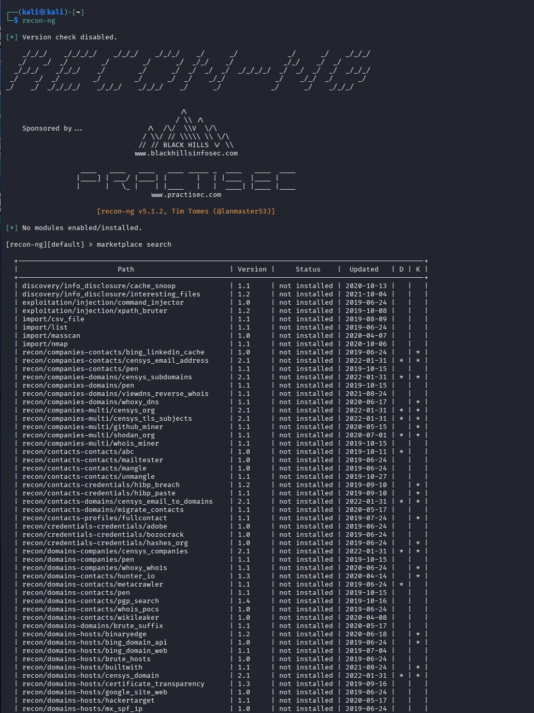
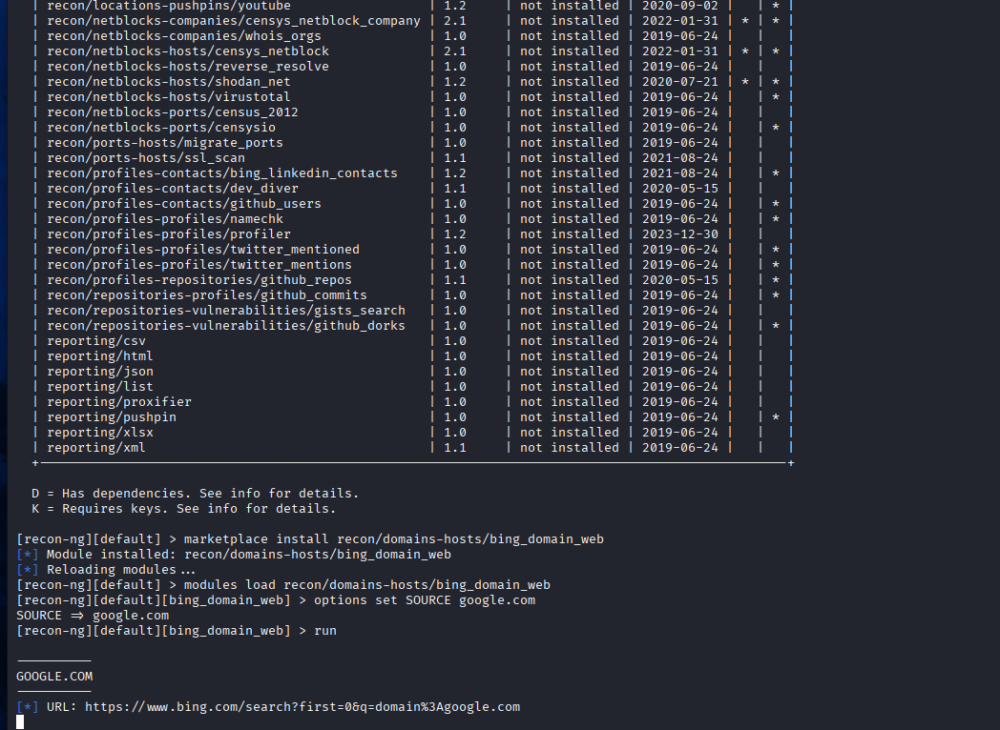
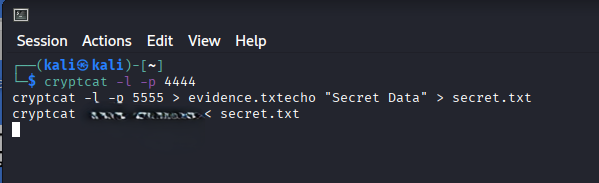
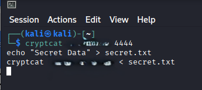
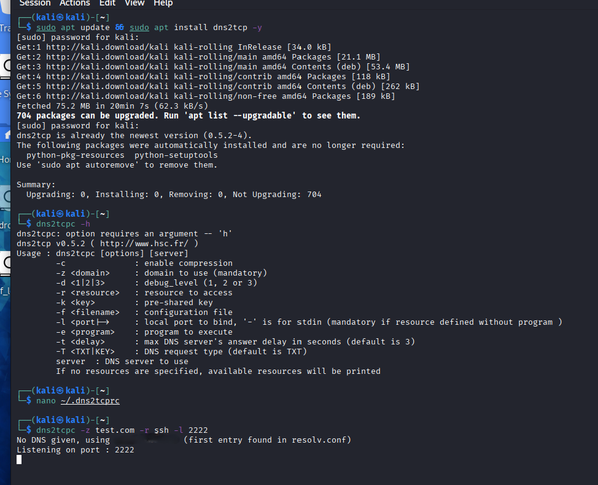
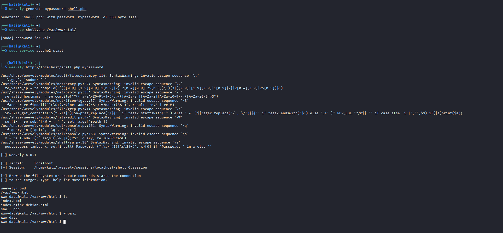
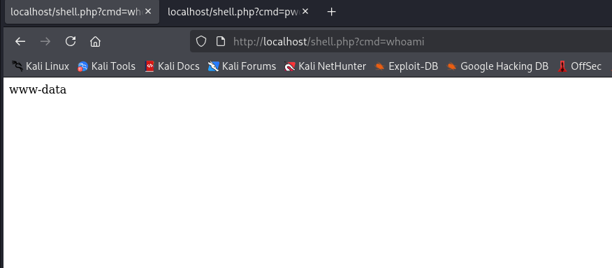
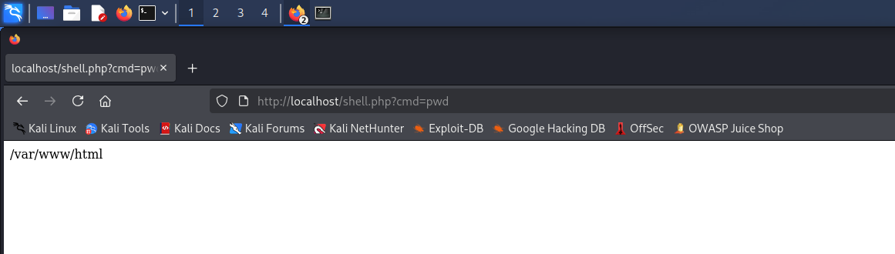
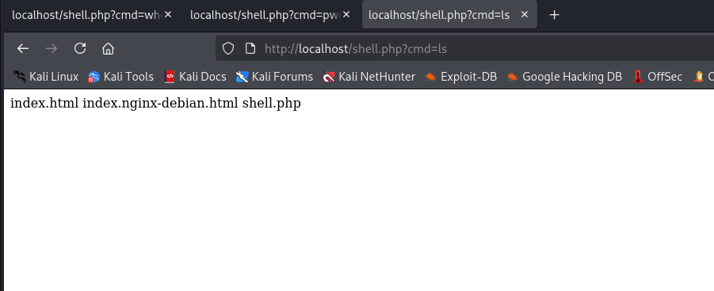
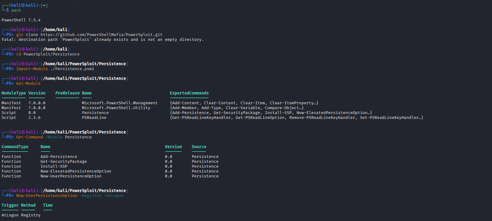

# 🛡️ Cyber Security Assignment 1
---
> **Disclaimer:** This project is for educational purposes only. All testing was performed in a controlled environment or on authorized targets.
## 👥 Group Members
- **PHRINCE POWLGREAT DIDYMUS** (25030698)  
- **NAVIN RAMAIAH** (25030584)  
---

## 📂 Table of Contents
1. Introduction  
2. Reconnaissance Tools  
   - Nmap  
   - DNSRecon  
   - Hping3
   - Recon-ng
3. Maintaining Access Tools  
   - Cryptcat  
   - Weevely  
   - Dns2tcp
   - Powersploit
   - Webshells
4. Comparison & Conclusions  
5. References  

---

## 🔎 Introduction
This assignment demonstrates reconnaissance and maintaining access using **Kali Linux tools** in a controlled VirtualBox environment.  
* Reconnaissance tools: Nmap, DNSRecon, Hping3  
* Maintaining access tools: Cryptcat, Weevely, Metasploit  

Screenshots were taken during testing, with sensitive information blacked out.

---

## 🕵️ Reconnaissance Tools

### 1. Nmap
**Features tested:**
* Basic port scan (`nmap localhost`)  
* Service/version detection (`nmap -sV localhost`)  
* Aggressive scan with OS detection (`nmap -A localhost`)  

**Screenshots:**  
 
.jpeg)  

---

### 2. DNSRecon
**Features tested:**
* Domain resolution (`nslookup google.com`)  
* DNS record enumeration (`dnsrecon -d google.com`)  
* Subdomain brute force (`dnsrecon -d google.com -t brt`)  

**Screenshots:**  
.jpeg)  
  

---

### 3. Hping3
**Features tested:**
* ICMP ping (`hping3 -1 localhost`)  
* TCP SYN scan (`hping3 -S -p 80 google.com`)  
* UDP test (`hping3 -2 -p 53 google.com`)  

**Screenshots:**   
  
.jpeg)

---
### 4. Recon-ng
**Features tested:**
* **Marketplace Search:** Used to browse the extensive module library to find relevant reconnaissance scripts for the target domain.
* **Module Installation:** Used to download and install specific modules (e.g., `bing_domain_web`) directly into the Recon-ng framework.
* **Automated Reconnaissance:** Used to execute modules against a target domain to automatically harvest publicly available URLs and host information.
**Screenshots:**

    

  
---

## 🔐 Maintaining Access Tools

### 1. Cryptcat
**Features tested:**
* **Feature 1: Encrypted Listener Setup** - Initializing a secure port to wait for target connection.
* **Feature 2: Bidirectional Communication** - Establishing a secure chat between two nodes.
* **Feature 3: Encrypted File Transfer** - Exfiltrating data (secret.txt) across the network stealthily.

**Screenshots:**

---

### 2. Weevely
**Features tested:**
* Generate PHP backdoor (`weevely generate password123 shell.php`)  
* Host shell with PHP server (`php -S 127.0.0.1:8000`)  
* Remote command execution (`weevely http://127.0.0.1:8000/shell.php password123`)  

**Screenshots:**  
  

---

### 2. Dns2tcp

**Features tested:**
* **Feature 1: Installation & Manual Analysis** - Accessed the help menu to identify flags like `-z` and `-r`.
* **Feature 2: Resource Configuration** - Created the `.dns2tcprc` file to map SSH resources.
* **Feature 3: Tunnel Establishment** - Successfully initiated the client to listen on local port 2222 for DNS tunneling.

**Screenshots:**

**Screenshots:**   
.jpeg)

---
### 4. Webshells (PHP-based)
**Features tested:**
* **System Identification (`whoami`):** Used to determine the privilege level of the web server user (e.g., `www-data`), which helps in planning for potential privilege escalation.
* **Directory Navigation (`pwd`):** Used to confirm the current working directory on the remote server, ensuring the tester knows exactly where they are within the web root.
* **File Enumeration (`ls`):** Used to list files in the current directory, allowing the tester to identify sensitive configuration files or source code for further analysis.

**Screenshots:**  

  
  

---
### 5. PowerSploit (Persistence Module)
**Features tested:**
* **Module Importation:** Used to load the PowerSploit framework into a current PowerShell session, allowing for the execution of advanced scripts that are not natively available on the target system.
* **Registry Persistence (`New-UserPersistenceOption`):** Used to create a persistence mechanism within the Windows Registry, ensuring the backdoor executes automatically every time the user logs in.
* **Exported Command Analysis:** Used to verify available persistence functions within the module, allowing the tester to choose the most stealthy method based on the target environment's configuration.

**Screenshots:**  

---

## 📊 Comparison & Conclusions
| Phase | Tool Examples | Primary Function |
| :--- | :--- | :--- |
| **Reconnaissance** | Nmap, DNSRecon,Hping3,Recon-ng | Gathering intelligence and mapping the attack surface[cite: 1]. |
| **Maintaining Access** | Webshells, PowerSploit,weevely,Crypcat,Dns2tcp| Ensuring long-term, stealthy control after exploitation[cite: 1]. |

**Conclusion:** A successful penetration test requires a transition from loud discovery to quiet, persistent access. Mastering these 9 tools allows a security professional to evaluate both the visible and hidden risks within a network..

---

## 📚 References
* Nmap Documentation – [Nmap.org](https://nmap.org/book/man.html)  
* DNSRecon GitHub – [DNSRecon Repository](https://github.com/darkoperator/dnsrecon)  
* Hping3 Manual – [Kali Linux Tools: Hping3](https://www.kali.org/tools/hping3/)  
* Cryptcat Documentation – [Cryptcat SourceForge](http://cryptcat.sourceforge.net/)  
* Weevely GitHub – [Weevely Repository](https://github.com/epinna/weevely3)  
* Metasploit Documentation – [Rapid7 Metasploit Docs](https://docs.rapid7.com/metasploit/)  ps://docs.rapid7.com/metasploit/)  
- Weevely GitHub – [Weevely Repository](https://github.com/epinna/weevely3)  
- Cryptcat Documentation – [Cryptcat Manual](http://cryptcat.sourceforge.net/)  
